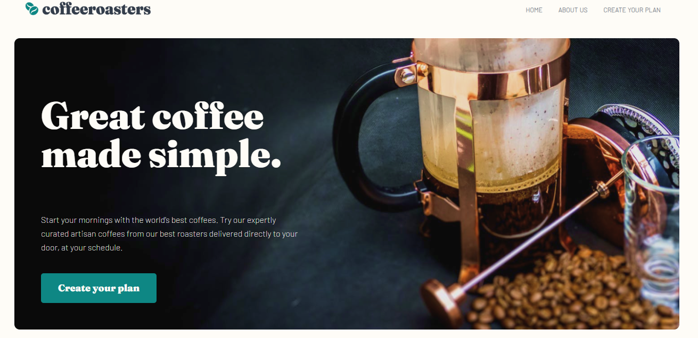

# Coffeeroasters Website

Welcome to the Coffeeroasters website project! This project focuses on creating a modern and user-friendly website for a coffee roasting business. It lets users explore coffee products and learn about the company's mission and offerings

## Table of Contents

- [Project Overview](#project-overview)
    - [Screenshot](#screenshot)
- [My process](#my-process)
  - [Built with](#built-with)
  - [What I learned](#what-i-learned)

## Project Overview

The Coffeeroasters website is designed to provide a delightful user experience for coffee enthusiasts. It features a visually appealing design and user-friendly navigation. Here's a brief overview of the project's key sections:

### Screenshot

## My process

### Built with

- Semantic HTML5 markup
- SCSS
- Flexbox
- Mobile-first workflow
- Vanilla JavaScript 

### What I learned
I embarked on this project with enthusiasm, and it served as a substantial learning experience for me. Despite the meticulous design analysis and thoughtful planning of reusable styles, I encountered various intriguing challenges throughout its development. These hurdles pushed me to expand my skill set and problem-solving abilities, making this project a valuable part of my journey. 

